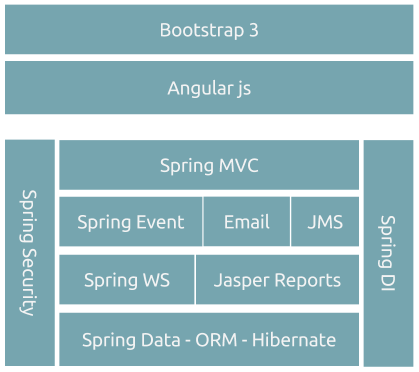

# Arquitetura Macro
Para novas aplicações recomendamos que seja utilizado conceito de [single page application](./front-end/single-page-app.md) juntamente com [Restful application](./back-end/basic-architecture.md).
Abaixo temos um modelo de composição dos frameworks que aderem bem a esta Arquitetura.

Lembrando que este **modelo de Arquitetura é uma referência, não uma diretriz**.


