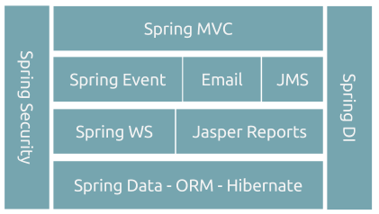
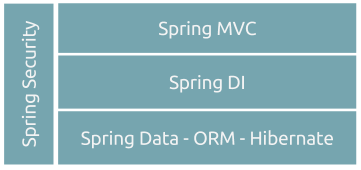

# Java Web Application Architecture

##### Exemplo de Arquitetura I
Este é um exemplo recomendado para aplicações web que necessitem de integração entre sistemas de forma assincrona.

##### Exemplo de Arquitetura II
Este é um exemplo simples de arquitura web, note que a variação é somente do número de componentes utilizados.

## Frameworks version
Segue abaixo alguns frameworks utilizados pela empresa, para todos é recomendado a **utilização da última versão**, de acordo com seu mapa de compatibilidade.


