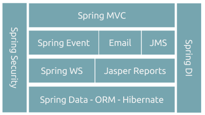
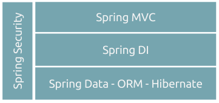

# Java Web Application Architecture

##### Sample Architecture I
Below is an example of application architecture, recommended for applications requiring integration between systems and asynchronous mechanisms

##### Sample Architecture II
Below an example of application architecture recommended for the simplest web applications without the need for complex processes

## Frameworks version
For all frameworks below we recommend to use **last version** of this, according to the dependencies compatibility map

Example : pom.xml

#### Manage Application dependence
* Maven


